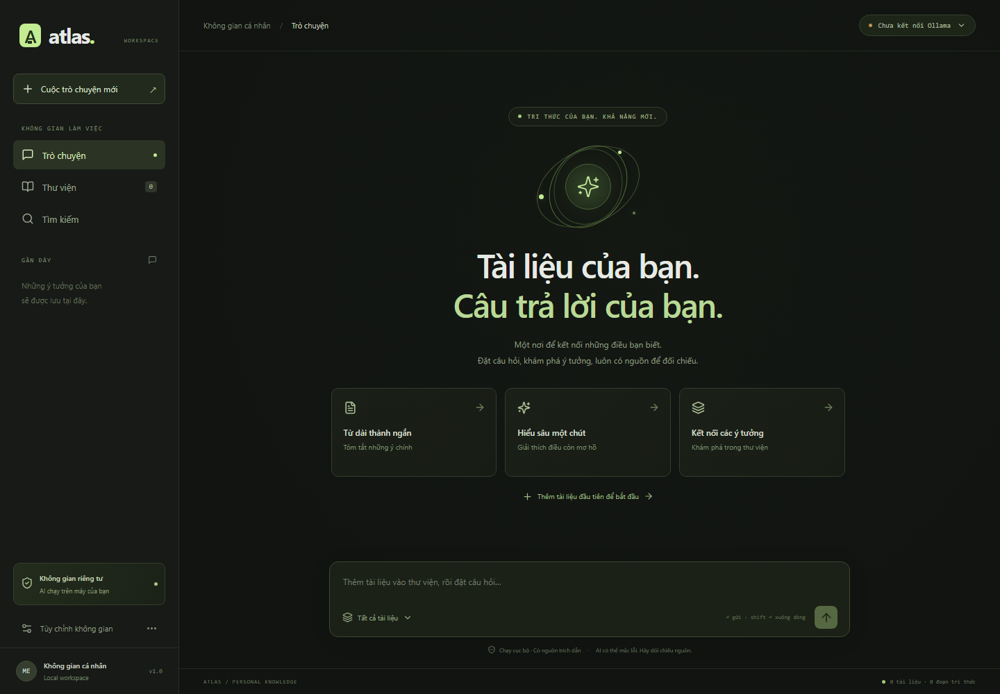
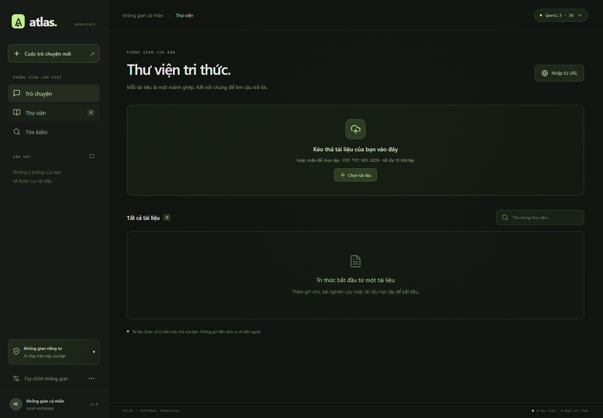
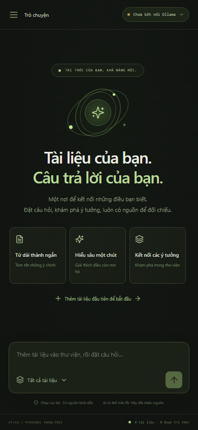

# Atlas

**Atlas** là dự án RAG cá nhân giúp tìm kiếm và hỏi đáp bằng tiếng Việt trong tài liệu học tập, ghi chú và bài nghiên cứu. Câu trả lời đi kèm các đoạn nguồn để người dùng đọc lại và đối chiếu.

**Công nghệ:** React + TypeScript · FastAPI · SQLite · Ollama/Docker · Qwen2.5:3b · bge-m3

## Tính năng nổi bật

| Tính năng | Trải nghiệm người dùng |
| --- | --- |
| Thư viện tài liệu | Kéo thả PDF, TXT, Markdown, JSON hoặc nhập một trang web; tự chia đoạn, lập chỉ mục và chống nạp trùng. |
| Hỏi đáp có nguồn | Nhận câu trả lời theo từng phần, bấm vào trích dẫn để xem đoạn nguồn và số trang nếu có. |
| Tìm kiếm kết hợp | Kết hợp tìm kiếm ngữ nghĩa và BM25; xem đoạn phù hợp, giới hạn phạm vi theo tài liệu. |
| Quản lý hội thoại | Lưu lịch sử, mở lại cuộc trò chuyện, dừng câu trả lời và xuất nội dung ra Markdown. |
| Không gian cá nhân | UI thích ứng desktop/mobile; tùy chỉnh số nguồn, ngưỡng truy xuất và mức linh hoạt của model. |

**Luồng RAG:** nhập tài liệu → chia đoạn → embedding bằng bge-m3 → hợp nhất thứ hạng ngữ nghĩa/từ khóa bằng RRF → Qwen2.5:3b tạo câu trả lời kèm nguồn. Tài liệu, vector và hội thoại được lưu trong SQLite; xử lý AI được cấu hình chạy cục bộ, không cần API key bên ngoài.

## Giao diện

**Không gian trò chuyện trên desktop** — điều hướng giữa Trò chuyện, Thư viện và Tìm kiếm, chọn phạm vi tài liệu và xem trạng thái model.



<details>
<summary>Xem thư viện tài liệu và giao diện trên điện thoại</summary>

**Thư viện tài liệu** — khu vực kéo thả tệp, nhập URL và tìm trong danh sách tài liệu.



**Giao diện trên điện thoại** — menu thu gọn và khung nhập câu hỏi thích ứng màn hình nhỏ.



</details>

## Chạy

Cài Docker Desktop, bật Linux containers. Khuyến nghị máy có 16 GB RAM; CPU được hỗ trợ, GPU NVIDIA là tùy chọn.

```sh
docker compose up -d --build
```

Mở **http://localhost:3000**. Lần đầu Docker tự tải hai model; kiểm tra bằng `docker compose logs -f models`. Thêm `examples/knowledge.md` tại **Thư viện** để thử.

```sh
# Dừng, giữ nguyên tài liệu và model
docker compose down

# NVIDIA GPU (cần Docker hỗ trợ GPU)
docker compose -f docker-compose.yml -f docker-compose.gpu.yml up -d --build
```

Tài liệu và hội thoại lưu trong volume `atlas-data`, model trong `ollama-models`. `down -v` sẽ xóa các volume này. Sau khi tải model, hỏi đáp tệp không cần internet hay API key; nhập URL cần internet.

[Phát triển và kiểm thử](docs/development.md) · [Kiến trúc và giới hạn](docs/architecture.md)

Ứng dụng dành cho một người dùng trên máy cá nhân; chưa có đăng nhập. PDF dạng ảnh cần OCR trước khi nhập. Mã Streamlit và dữ liệu Milvus cũ được giữ để tham khảo, không dùng trong ứng dụng mới.
