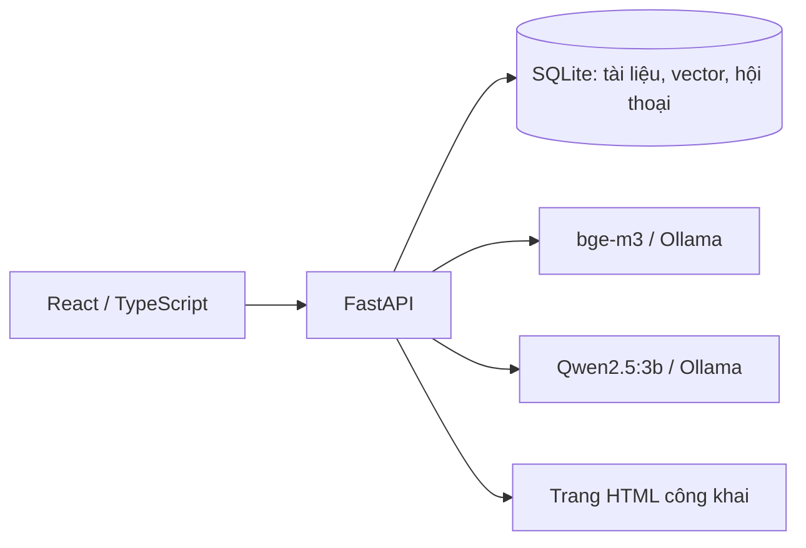

# Kiến trúc

Một container ứng dụng phục vụ API và frontend đã build trên cùng origin. Ollama phục vụ cả hai model;
container `models` tải chúng khi khởi động. UI mở được trong lúc model đang tải và hiển thị trạng thái thực tế.
Model và dữ liệu nằm trong named volumes độc lập với code. Compose mặc định chỉ publish lên loopback.

## Nhập và lưu tài liệu

PDF được trích xuất theo trang, TXT/Markdown đọc UTF-8, JSON tương thích `{page_content, metadata}` của dự án cũ.
Chia đoạn 1.100 ký tự, chồng lấp 160 ký tự, ưu tiên ranh giới đoạn/câu. Số trang được giữ làm metadata.
bge-m3 tạo embedding theo batch 16 đoạn. Chỉ commit tài liệu sau khi tất cả batch thành công;
SHA-256 của nội dung, metadata trang và tên embedding model giúp chống trùng.
Không ghi tệp upload tùy ý lên filesystem và không xóa thư viện khi thêm tài liệu.

URL import tải một trang HTML, bỏ script/navigation và ưu tiên nội dung `main`/`article`.
Mỗi redirect được xác thực lại. Chặn IP nội bộ, link-local, thông tin đăng nhập và cổng không tiêu chuẩn;
kết nối ghim IP đã kiểm tra, TLS vẫn xác thực hostname để tránh DNS rebinding.
Không crawl đệ quy, chạy JavaScript hoặc vượt trang đăng nhập.

## Truy xuất và trả lời

1. Áp dụng bộ lọc tài liệu trước khi tìm kiếm.
2. Kiểm tra tên model và số chiều vector đã lưu.
3. Tính cosine similarity trên toàn bộ các đoạn trong phạm vi.
4. Tính BM25 trên cùng tập đoạn, chuẩn hóa từ tiếng Việt để hỗ trợ tìm không dấu.
5. Hợp nhất thứ hạng bằng weighted reciprocal rank fusion (70% ngữ nghĩa, 30% từ khóa).
6. Cấp tối đa 8 nguồn và lịch sử giới hạn cho Qwen; gửi token về UI bằng SSE.

Ngưỡng ngữ nghĩa chỉ lọc nhánh cosine; đoạn khớp BM25 vẫn có thể được trả về.
Không có nguồn phù hợp: trả lời rõ chưa tìm thấy, không gọi LLM. Lỗi hạ tầng được báo thành lỗi,
không dùng nội dung lỗi giả làm nguồn. Nguồn được lưu cùng message để còn đối chiếu sau khi tài liệu gốc bị xóa.
Mỗi hội thoại chỉ tạo một câu trả lời tại một thời điểm. Khi dừng hoặc lỗi, lưu câu trả lời dở dang với trạng thái riêng.

Prompt yêu cầu model trích dẫn `[n]`, bám sát nguồn và bỏ qua chỉ dẫn trong tài liệu.
Đây là hướng dẫn cho model, không đảm bảo chống mọi prompt injection hoặc xác minh từng luận điểm.
Các chip nguồn hiển thị đoạn được truy xuất; cần kiểm tra nội dung có thực sự hỗ trợ kết luận.
Cosine similarity là mức tương đồng, không phải xác suất câu trả lời đúng.
